## business-wallet
**波场（Tron）企业钱包web版**

#### 一. Tron
[开放平台](https://cn.developers.tron.network/docs)

[浏览器](https://tronscan.org/)

#### 二. 核心业务逻辑
1. TRX 和 TRC20(USDT) 转账交易

2. 系统自动检测每个企业账号下属的所有子账号，检测到有TRX和USDT交易，会自动的将
子账号的TRX和USDT转账到所属的企业账号上(公链)

例如: 

企业账号: `TL1NwMonusScAFJbRQkPDykBK55jUaDLvB11`

该企业账号下属一百个子账号(数量不限)
这里以子账号: `TYWNXheZ4HNb9PsLYyQfesdHoYRSrekxk4`为例
当子账号`TYWNXheZ4HNb9PsLYyQfesdHoYRSrekxk4`有trx和usdt的交易进来
系统就会自动检测到，并将子账号`TYWNXheZ4HNb9PsLYyQfesdHoYRSrekxk4`
收到的trx和usdt自动转到企业账号地址上去(`TL1NwMonusScAFJbRQkPDykBK55jUaDLvB11`) (公链)
,并将交易结果回调通知.

3. 可以通过解析区块高度开关按钮，控制程序是否解析区块高度
按钮关闭，不再解析区块最高。并保存关掉时刻的区块高度。打开按钮，会从之前的区块高度从新解析，程序会自动加速去追Tron的区块高度。
当程序追上区块高度之后，会自动降速。

检测交易速度:

**解析区块高度的速度追上tron区块产生的速度**

#### 三. web页面功能简介
1. 登陆（平台管理员登陆 | 企业账号登陆）
2. 首页 （企业商户管理）

    * 2.1 创建企业账号 (自动生成 key和secret)
    * 2.2 回掉地址 (可用于企业技术人员对接)
    * 2.3 资产 （TRX | USDT）
    * 2.4 修改冷钱包地址
    * 2.5 更换热钱包地址
    * 2.6 回调地址修改
    * 2.7 修改密码
    * 2.8 子号
      * 2.8.1 资产展示
      * 2.8.2 交易记录
        * 2.8.2.1 手动回调

3. 设置
    * 3.1 留存设置
      * 添加
      * 修改
    * 3.2 合约设置 (USDT 也可以是其他 TRC20币种)
      * 添加
      * 删除
    * 3.3 解析区块开关

#### 四. 架构图

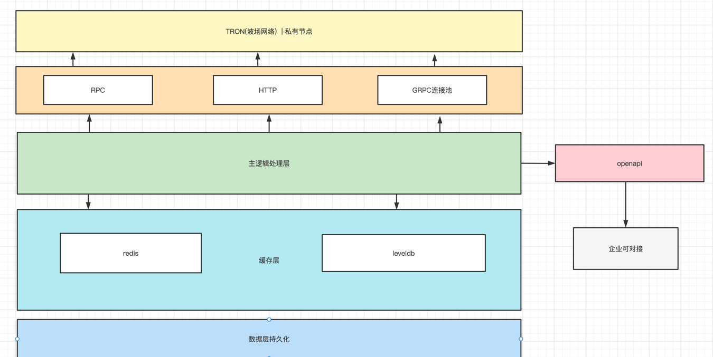

#### 五. 环境安装 + 部署文档 + 后端代码 + 前端代码 + sql文件
docker + shell + Dockerfile

### 六. web页面预览
**平台管理员账号**
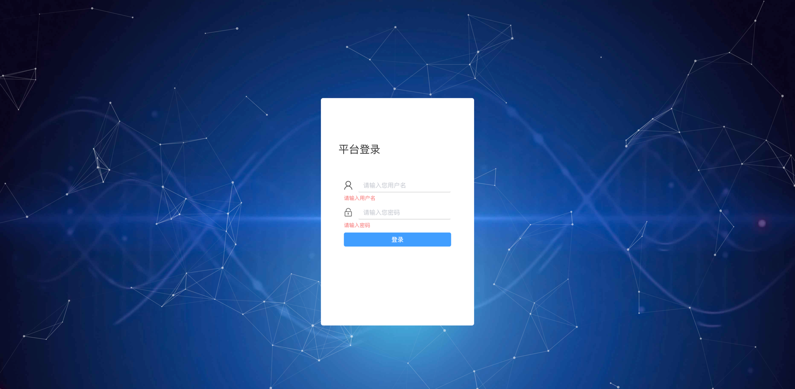
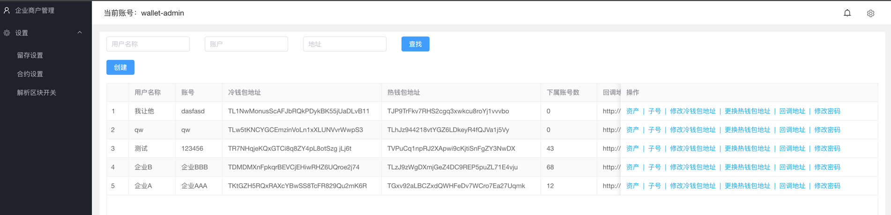
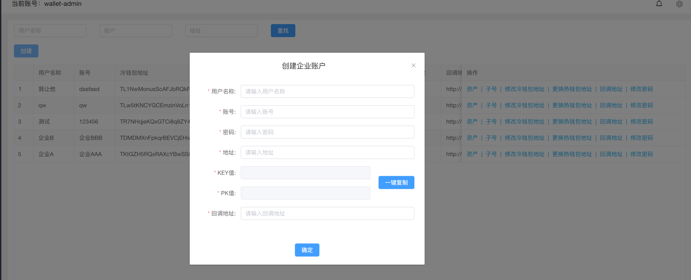
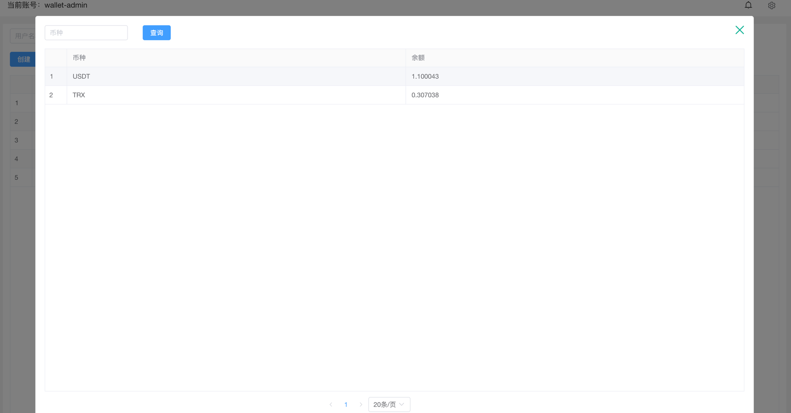
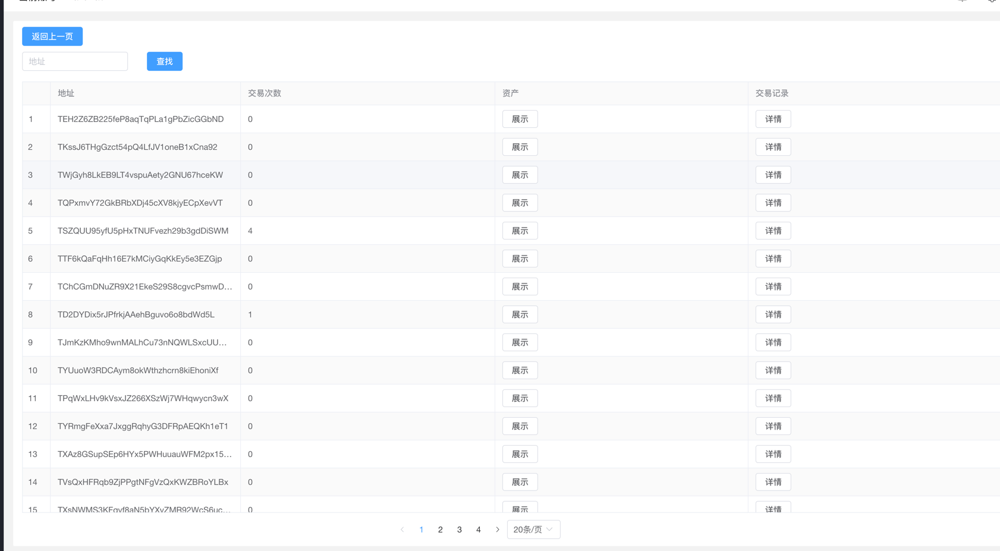
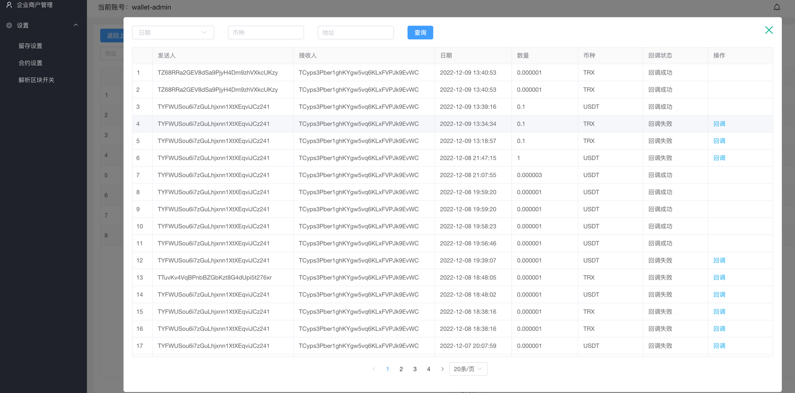
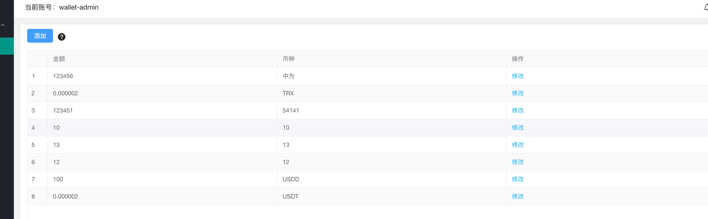
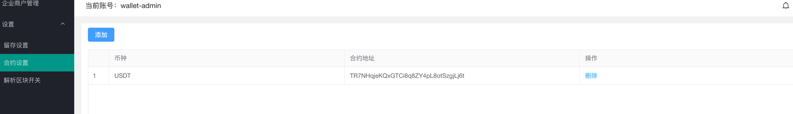
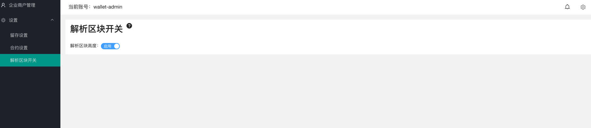

**企业账号登陆**

只显示当前企业的账号信息、资产信息、所属的子账号信息（资产、交易记录等）

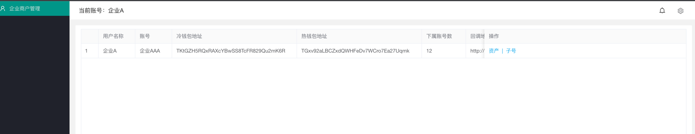

#### 七. 联系方式
weixin： laomao12a
Telegram: https://t.me/laomaok

